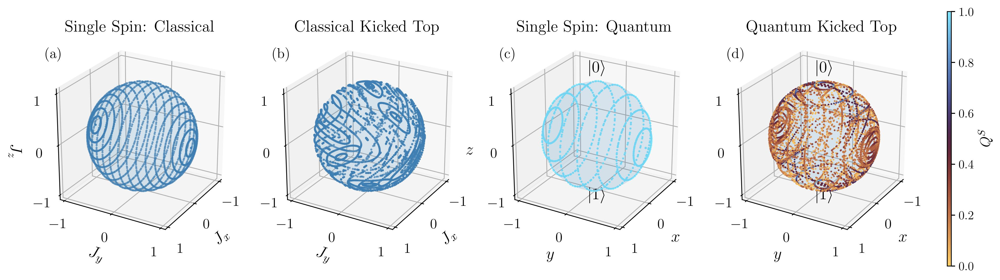
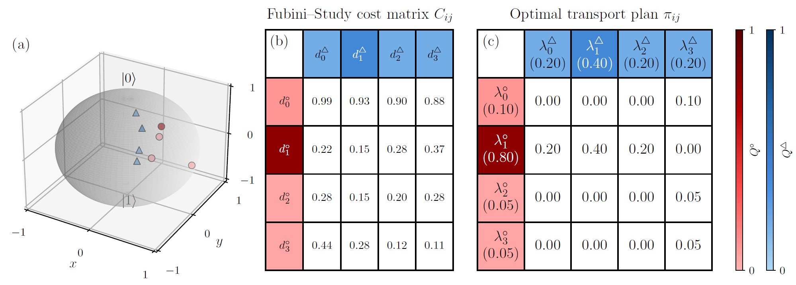
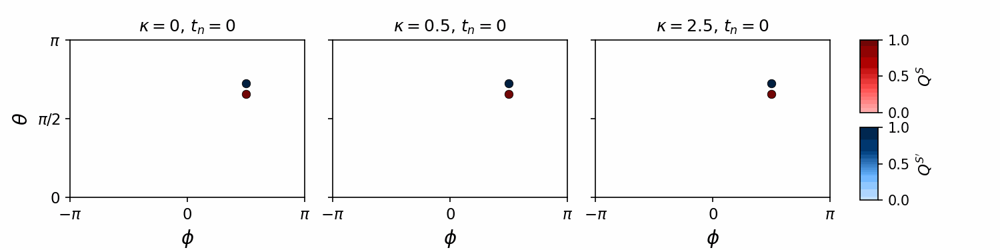
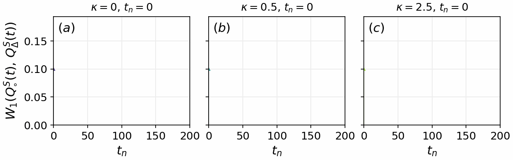
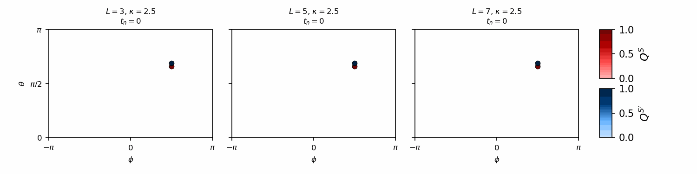
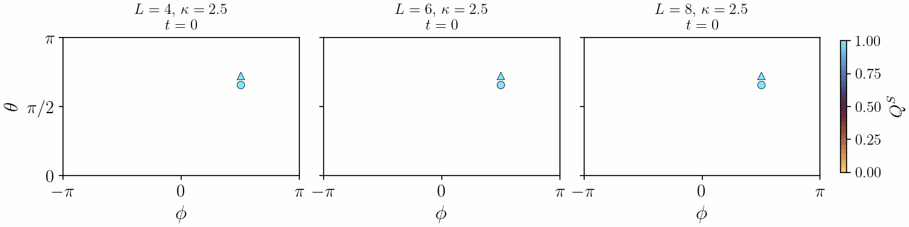

# State-Based Diagnostics of Quantum Dynamical Complexity

This repository implements a **state-based, geometric framework** for quantifying dynamical complexity in interacting quantum systems.

 

The approach extends classical notions of **trajectory sensitivity** and **phase-space exploration** to quantum systems by representing subsystem dynamics as **probability measures over projective Hilbert space**, referred to as **geometric quantum states (GQS)**.

---

## 🧠 Why Geometric Quantum States?

**System-envionment state (Global State)**: $$|\Psi_{SE}(t)\rangle =\sum_{k=1}^{d_S}\sum_{j=1}^{d_E}\psi_{kj}(t) |s_k\rangle \otimes |e_j\rangle$$

**System-envionment state (environment-conditioned decomposition)**: $$|\Psi_{SE}(t)\rangle=\sum_{j=1}^{d_E}\sqrt{\lambda_j^{E}(t)} |\chi_j^{S}(t)\rangle|e_j\rangle .$$
- $$|\chi_j^{S}(t)\rangle=\frac{1}{\sqrt{\lambda_j^{E}(t)}} \sum_{k=1}^{d_S}\psi_{kj}(t)|s_k\rangle,$$
- $$\lambda_j^{E}(t)=\sum_{k=1}^{d_S}|\psi_{kj}(t)|^2$$.

**System state - Reduced Density Matrix**: $$\rho_S(t) = \sum_{j=1}^{d_E}\lambda_j^{E}(t)|\chi_j^{S}(t)\rangle\langle\chi_j^{S}(t)|$$
- reproduces all observable statistics of the subsystem
- encodes this ensemble structure only implicitly, distinct probability distributions on $\mathbb{C}P^{d_S-1}$ may correspond to the same density matrix

**System state - Geometric Quantum State**: $$Q^S(Z,t)=\sum_{j=1}^{d_E}\lambda_j^{E}(t) \delta \left(Z-\mathbf{Z}_j^{S}(t)\right) \in \mathcal{P} \left(\mathbb{C}P^{d_S-1}\right),$$ where $\mathbf{Z}_j^{S}(t)$ denotes the point in projective Hilbert space corresponding to $|\chi_j^{S}(t)\rangle$.
- retain the **distribution of pure states** on projective Hilbert space,
- distinguish geometrically distinct ensembles with identical density matrices,
- provide a natural connection to **optimal transport geometry**.

---

## 📐 Distance Measures

- **Fubini–Study distance**  
  Geometry of pure states on projective Hilbert space

- **Wasserstein distance (primary tool)**  
  Quantifies transport of probability mass between GQS ensembles
  

- *(Optional)* Operator-based distances for comparison

---

## ✨ Core Idea

We study how **small differences in global quantum preparations** manifest at the level of **local subsystem dynamics** under interactions. 

Distances between these ensembles are computed using **Wasserstein (optimal transport) geometry**, directly capturing how probability mass **deforms and spreads** on the quantum state manifold. This provides a**state-based perspective on quantum complexity**, complementing operator-based diagnostics such as OTOCs and Loschmidt echoes.

 

---

## 🔬 Diagnostics of Quantum Complexity

This framework introduces two complementary diagnostics:

• **Distinguishability Measure (Γ)** - Measures the average exponential growth of distances between nearby GQS ensembles similar to Maximal Lyapunov exponent

•  **State-Space Coverage Index (SSCI)** - Measures how widely the subsystem explores its state space over time. 

Together, these define a **two-dimensional characterization of complexity**:

---

## ⚙️ Computational Workflow

1. Initialize a global spin-coherent product state  
2. Apply a small perturbation to generate nearby initial conditions  
3. Evolve under a global interacting Hamiltonian (e.g. quantum kicked top)  
4. Construct environment-conditioned subsystem states  
5. Build geometric quantum state ensembles (GQS)  
6. Compute Wasserstein distances between ensembles  
7. Estimate:
   - **Γ (sensitivity)**
   - **SSCI (state-space exploration)**

---

## 📊 What This Repository Enables

- Quantification of **interaction-induced complexity** using 
- Visualization of **deformation of subsystem state space**
- Analysis of:
  - interaction strength (κ)
  - initial state dependence (θ, φ)
  - environment size (Lₑ)
  - even–odd system-size effects

  
  
---

## 📌 Key Perspective

Complexity in quantum systems emerges not only through operator growth, but through the **geometric redistribution of probability mass** over the space of pure states.

This framework makes that redistribution **directly measurable and interpretable**.

---

%## 🔗 Links

%- 📄 Paper: *[add arXiv link here]*  
%- 💻 Repository: *[this repository]*  


---

## Install

### Option A: editable install (recommended for development)
```bash
pip install -e .
```

### Option B: install pinned dependencies only
```bash
pip install -r requirements.txt
```

## Package layout
- `gqs/operators.py`: spin operators
- `gqs/states.py`: initial states + reduced/conditional states
- `gqs/dynamics.py`: kicked-top Hamiltonian + Floquet operator
- `gqs/gqs.py`: GQS / Bloch utilities + visualizations
- `gqs/distances.py`: Fubini–Study + Wasserstein (OT) distances
- `gqs/entropy.py`: entropy/purity utilities
- `gqs/perturbations.py`: (theta,phi) perturbation helpers
- `gqs/gamma.py`: Gamma / separation-rate computations
- `gqs/plotting.py`: plotting helpers

