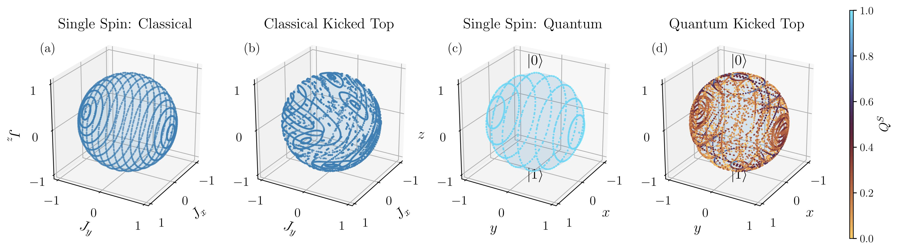
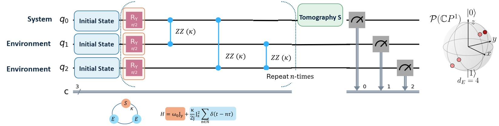
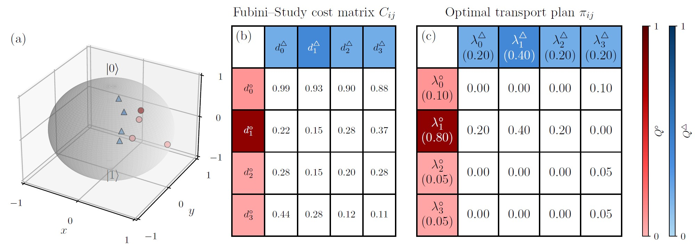
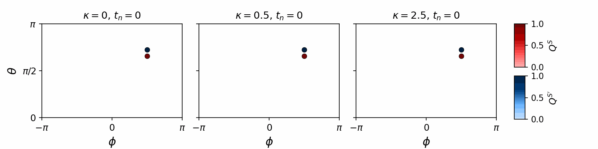
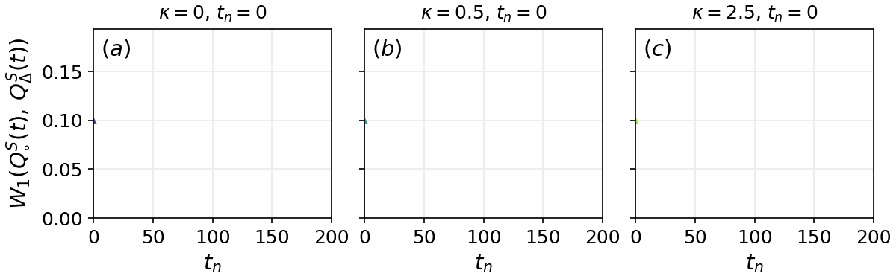
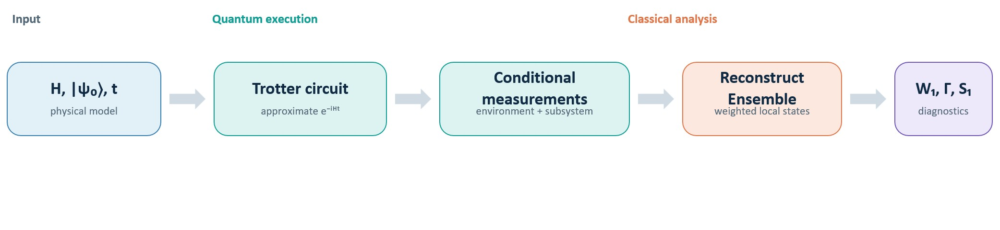
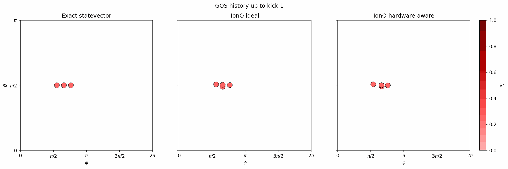
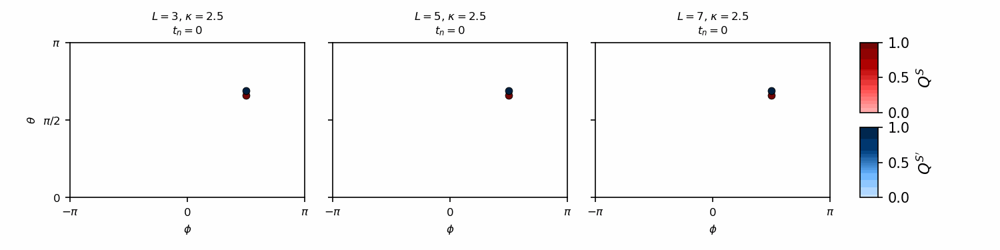
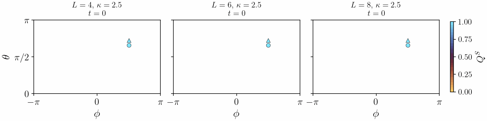

# State-Based Diagnostics of Quantum Dynamical Complexity

This repository implements a **state-based geometric framework** for quantifying dynamical complexity in interacting quantum systems.



The framework extends the classical ideas of **sensitivity to initial conditions** and **phase-space exploration** to quantum systems. Subsystem dynamics are represented as probability measures on projective Hilbert space, referred to as **geometric quantum states (GQSs)**.

---

##  Why Geometric Quantum States? — Notebook 1

Consider a quantum system $S$ coupled to an environment $E$. The global state can be written as

$$|\Psi_{SE}(t)\rangle =\sum_{k=1}^{d_S}\sum_{j=1}^{d_E}\psi_{kj}(t) |s_k\rangle \otimes |e_j\rangle$$

Conditioning on the environment basis $\{|e_j\rangle\}$ gives the decomposition

$$|\Psi_{SE}(t)\rangle=\sum_{j=1}^{d_E}
\sqrt{\lambda_j^E(t)}
\,|\chi_j^S(t)\rangle |e_j\rangle , \qquad \text{where} \lambda_j^E(t) =
\sum_{k=1}^{d_S}
|\psi_{kj}(t)|^2 , \qquad \text{and, for $\lambda_j^E(t)>0$,} |\chi_j^S(t)\rangle=
\frac{1}{\sqrt{\lambda_j^E(t)}}
\sum_{k=1}^{d_S}
\psi_{kj}(t)|s_k\rangle .
$$

For a joint pure state of a system $S$ and environment $E$, measuring the environment in a fixed basis yields conditional system states $|\chi_j^S(t)\rangle$ with probabilities $\lambda_j^E(t)$. These define two representations:

$$
\rho_S(t)=\sum_j \lambda_j^E(t)|\chi_j^S(t)\rangle\langle\chi_j^S(t)|,
\qquad
Q^S(Z,t)=\sum_j \lambda_j^E(t)\delta\left(Z-\mathbf{Z}_j^S(t)\right).
$$

The reduced density matrix reproduces all subsystem observable statistics. The geometric quantum state (GQS) retains the distribution of conditional pure states, distinguishing ensembles with identical density matrices and enabling comparisons through optimal transport. Here, $\mathbf{Z}_j^S(t)$ represents $|\chi_j^S(t)\rangle$ in projective Hilbert space.

> **Basis dependence:** The environment-conditioned GQS depends on the chosen environment basis. The calculations in this repository use conditioning in the computational basis.

### Geometric quantum state - Measurement Protocol
The GQS can be reconstructed experimentally by combining measurements of the environment with conditional state tomography of the system.


---

## 📐 Distance Measures — Notebook 2

### Fubini–Study distance

The **Fubini–Study distance** measures the geometric separation between pure states in projective Hilbert space.

### Wasserstein distance

The **Wasserstein distance** is the primary distance used in this framework. It quantifies the minimum transport cost required to transform one GQS probability measure into another, using the Fubini–Study distance as the underlying ground metric.



Operator-based distances between reduced density matrices can also be computed for comparison.

---

## 🔬 Diagnostics of Quantum Complexity - Notebook-3,4

We study how interactions among qubits affect the local dynamics of a selected subsystem.

Wasserstein geometry directly captures how environment-conditioned probability measures **separate, deform, and spread** across the quantum state manifold. This provides a state-based perspective on quantum dynamical complexity that complements operator-based diagnostics such as out-of-time-order correlators and Loschmidt echoes.





The framework introduces two complementary diagnostics:

- **Distinguishability measure $\Gamma$:** quantifies the growth or decay of the Wasserstein distance between initially nearby GQS measures. It plays a role analogous to a finite-time Lyapunov-type sensitivity measure for probability distributions.

- **State-Space Coverage Index (SSCI):** quantifies how broadly the subsystem explores projective Hilbert space over time.

These diagnostics provide a two-dimensional characterization of subsystem dynamics by separating:

1. **sensitivity to initial conditions**, measured by $\Gamma$; and
2. **long-time state-space exploration**, measured by the SSCI.

---
##  Quantum Algorithm for Local Quantum Dynamics - Notebook-5


This notebook presents a hybrid quantum–classical workflow for studying local quantum dynamics through geometric quantum states (GQS). Starting from a Hamiltonian $H$, initial state $|\psi_0\rangle$, and evolution time $t$, a Trotter circuit approximates the joint evolution. Environment measurements and conditional subsystem tomography provide the data for reconstructing the local ensemble.


---

## ⚙️ Computational Workflow

1. Initialize a global spin-coherent product state.
2. Apply a small perturbation to generate a nearby initial state.
3. Evolve both states under a global interacting model, such as the quantum kicked top.
4. Construct the environment-conditioned subsystem states.
5. Represent the subsystem dynamics as GQS probability measures.
6. Compute Wasserstein distances between the reference and perturbed GQSs.
7. Estimate:
   - $\Gamma$, describing sensitivity to perturbations;
   - the SSCI, describing state-space exploration.

---

## 📊 What This Repository Enables

This repository provides tools for:

- quantifying interaction-induced quantum dynamical complexity;
- visualizing local subsystem dynamics on projective Hilbert space;
- comparing GQS-based and density-matrix-based descriptions;
- studying the dependence of subsystem dynamics on:
  - interaction strength $\kappa$;
  - initial-state coordinates $(\theta,\phi)$;
  - environment size $L_E$;
  - integer- and half-integer-spin system sizes.





---

## Install

### Option A: editable install (recommended for development)
```bash
pip install -e .
```

### Option B: install pinned dependencies only
```bash
pip install -r requirements.txt
```

## Package layout
- `gqs/operators.py`: spin operators
- `gqs/states.py`: initial states + reduced/conditional states
- `gqs/dynamics.py`: kicked-top Hamiltonian + Floquet operator
- `gqs/gqs.py`: GQS / Bloch utilities + visualizations
- `gqs/distances.py`: Fubini–Study + Wasserstein (OT) distances
- `gqs/entropy.py`: entropy/purity utilities
- `gqs/perturbations.py`: (theta,phi) perturbation helpers
- `gqs/gamma.py`: Gamma / separation-rate computations
- `gqs/plotting.py`: plotting helpers

